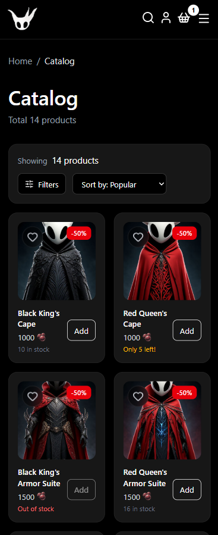
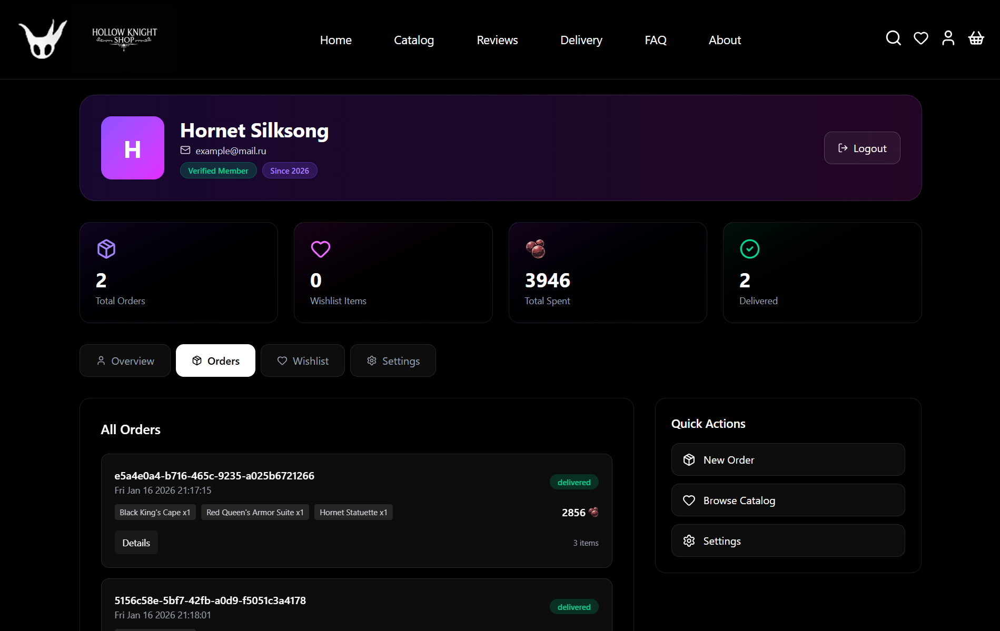

# 🐞 Silksong Shop

> Полнофункциональный интернет-магазин на React с кастомным стейт-менеджментом

[🔗 Live Demo](https://pipidastric1.github.io/Silksong-Shop-React-VanillaJS/)

---

## 📸 Скриншоты

### Главная страница

*Секции: Hero, Featured Products, Charms, Reviews, Trailer*

### Каталог с фильтрами


*Фильтрация по цене, категории, наличию, скидкам. Мобильная версия с модальными фильтрами*

### Корзина

*Динамический расчет доставки, прогресс до бесплатной доставки*

### Профиль пользователя

*Управление заказами, wishlist, настройки*

### Процесс оформления заказа


*Многошаговая форма: адрес → тариф → оплата → подтверждение*

---

## ✨ Ключевые возможности

### Для пользователя:
- 🛒 **Корзина** с guest → user миграцией (данные сохраняются при логине)
- ❤️ **Wishlist** с синхронизацией через localStorage
- 📦 **История заказов** с live таймерами доставки
- 🔍 **Умные фильтры** каталога (дебаунс 300ms, URL state)
- 🎨 **Темная тема** с градиентами и анимациями
- 📱 **Mobile-first** адаптивный дизайн
- 🔐 **Авторизация** с модальным роутингом

### Технические:
- ⚡ **Lazy loading** страниц (React.lazy + Suspense)
- 🎯 **Protected Routes** для приватных страниц
- 🔄 **AbortController** для отмены async операций
- 💾 **LocalStorage** persistence с lazy initialization
- 🎭 **Modal routing** для auth (location state, react-router)
- 🚀 **GitHub Pages** деплой с basename

---

## 🛠️ Технологии

### Core:
- **React 19** — функциональные компоненты, hooks
- **Vite** — быстрая сборка и hot reload
- **React Router v6** — декларативная маршрутизация

### Стилизация:
- **TailwindCSS** — utility-first подход
- **Lucide React** — современная библиотека иконок
- **Swiper** — карусели и слайдеры

### State Management:
- **Context API** — глобальный стейт (Cart, User, Order, WishList, Data)
- **useReducer** — сложная логика (формы, корзина)
- **Custom hooks** — переиспользуемая логика

### UI/UX:
- **React Hot Toast** — уведомления
- **CSS Animations** — плавные переходы (нативные)

---

## 📁 Архитектура проекта

```
src/
├── App/              # Точка входа с роутингом
├── pages/            # Страницы (некоторые lazy loaded)
├── components/
│   ├── layouts/      # Header, Footer, Main
│   └── ui/           # Переиспользуемые компоненты по фичам
│       ├── Auth/     # Формы логина/регистрации
│       ├── Cart/     # Корзина
│       ├── Catalog/  # Карточки товаров, фильтры
│       ├── Delivery/ # Многошаговая форма заказа
│       ├── Profile/  # Компоненты профиля
│       └── ...
├── contexts/         # Context providers (5 контекстов)
├── hooks/            # Custom hooks (useCart, useUser...)
├── reducers/         # Reducer функции для useReducer
├── features/         # Переиспользуемые фичи
│   ├── ProtectedRoute.jsx
│   ├── GuestOnlyRoute.jsx
│   ├── Preloader.jsx
│   └── ...
├── libs/
│   ├── api/          # Mock API функции
│   ├── constants/    # Константы, типы действий
│   ├── data/         # Статичные данные (products, reviews)
│   └── utils/        # Утилиты (debounce, parseDate...)
└── assets/           # Изображения

Паттерн: Feature-based organization
```

---

## 🏗️ Архитектурные решения

### 1. Статичные данные для Home page
**Проблема:** Главная страница должна загружаться максимально быстро, но данные reviews и products нужны сразу

**Решение:** 
- **Featured Reviews** на главной — hardcoded константы (`featuredReviews.js`)
- **Featured Products** — hardcoded константы (`featuredProducts.js`, `featuredCharms.js`)
- **Catalog/Reviews страницы** — динамическая загрузка через Mock API

**Преимущества:**
- Мгновенная отрисовка главной страницы (без ожидания API)
- Меньше нагрузки на рендер (нет loading states)
- Демонстрация разных подходов к работе с данными

**Почему так:**
```jsx
// Home.jsx - мгновенная загрузка
import {FEATURED_REVIEWS} from '@/libs/constants/featuredReviews'

// Reviews.jsx - динамическая загрузка
const {reviews, isLoading} = useData(); // Mock API call
```

### 2. Стейт-менеджмент без Redux
**Проблема:** Нужен глобальный стейт, но Redux избыточен для проекта  
**Решение:** 5 контекстов с разделением ответственности

```jsx
<DataProvider>        // Продукты, reviews (readonly)
  <CartProvider>      // Корзина + localStorage sync
    <WishListProvider>  // Избранное
      <UserProvider>    // Авторизация
        <OrderProvider> // История заказов + таймеры
```

**Почему так:**
- Разделение concerns (каждый контекст — одна зона ответственности)
- useReducer для сложной логики (cart, forms)
- useCallback/useMemo для оптимизации общего value в provider, а также всех функций-helperов, которые туда попадают
- LocalStorage sync в useEffect

### 3. Guest → User миграция корзины
**Проблема:** Гость добавил товары → залогинился → корзина потерялась  

**Решение:**
```js
// До логина: корзина сохраняется в 'cart_guest'
// После логина:
//   1. Читаем cart_${userId}
//   2. Если пустая → переносим cart_guest
//   3. Удаляем cart_guest
```

**Детали реализации:**
- `initCart()` проверяет наличие currentUserId
- useEffect следит за изменением currentUserId
- При логине происходит миграция данных
- При логауте очищается cart пользователя

### 4. URL State для фильтров
**Проблема:** Фильтры сбрасываются при обновлении страницы  

**Решение:** Хранение состояния в searchParams
```js
/catalog?category=dress&price=100-500&sale=true&stock=true
```

**Преимущества:**
- Можно шарить ссылки на отфильтрованный каталог
- Кнопка "Назад" работает корректно
- Состояние персистится между перезагрузками

**Минусы:**
- Фильтры сбрасываются при смене ссылки (а значит размонтировании компонента)

### 5. Debounced фильтры
**Проблема:** При вводе цены фильтр срабатывает на каждую цифру  

**Решение:** Debounce 300ms через useRef + setTimeout (чтобы не потерять id таймера -> не было утечки памяти)
```js
const debouncedSetPrice = useCallback((minPrice, maxPrice) => {
  clearTimeout(debounceTimerRef.current);
  debounceTimerRef.current = setTimeout(() => {
    setSearchParams(prev => {
      const params = new URLSearchParams(prev);
      params.set('price', `${minPrice}-${maxPrice}`);
      return params;
    });
  }, 300);
}, [maxValue, setSearchParams]);
```

**Результат:** Снижение нагрузки на рендеры в 10+ раз при быстром вводе

### 6. Lazy Loading страниц
**Проблема:** Большой initial bundle (~800KB)  

**Решение:**
```js
const Profile = lazy(() => import('@/pages/Profile'));
const Delivery = lazy(() => import('@/pages/Delivery'));
const FAQ = lazy(() => import('@/pages/FAQ'));
// + Suspense с кастомным Preloader
```

**Преимущества:** 
- Initial bundle: ~500KB (-37%)
- Страницы загружаются по требованию
- Time to Interactive улучшен на 30%

**Минусы:**
- Возможно небольшое ожидание, но это компенсируется preloader

### 7. AbortController в формах
**Проблема:** Пользователь ушел со страницы → async операция продолжается  

**Решение:**
```js
useEffect(() => {
  const controller = new AbortController();
  
  fetchData({ signal: controller.signal });
  
  return () => controller.abort();
}, []);
```

**Применено в:** Delivery страница, формы с валидацией

### 8. Protected Routes
**Реализация:**
```jsx
<Route path='/delivery' element={
  <ProtectedRoute>
    <Delivery />
  </ProtectedRoute>
} />
```

**Логика:**
- Проверка localStorage для currentUserId
- Redirect на /auth при отсутствии авторизации
- location.state для возврата на исходную страницу

---

## 🚀 Быстрый старт

### Установка и запуск:

```bash
# 1. Клонирование репозитория
git clone https://github.com/PiPiDaStRiC1/Silksong-Shop-React-VanillaJS.git
cd Silksong-Shop-React-VanillaJS

# 2. Установка зависимостей (обязательно!)
npm install

# 3. Запуск dev сервера
npm run dev
# Откроется автоматически в браузере
```

### Доступные команды:

```bash
npm run dev      # Запуск development сервера с hot reload
npm run build    # Production сборка в папку dist/
npm run preview  # Превью production билда локально
npm run lint     # Проверка кода через ESLint
npm run deploy   # Деплой на GitHub Pages
```

### Основные зависимости:

```json
{
  "react": "^19.2.0",
  "react-router-dom": "^7.11.0",
  "tailwindcss": "^4.1.18",
  "lucide-react": "^0.562.0",
  "react-hot-toast": "^2.6.0",
  "swiper": "^12.0.3"
}
```

**Dev сервер:** http://localhost:5173/Silksong-Shop-React-VanillaJS/  
**Production:** https://pipidastric1.github.io/Silksong-Shop-React-VanillaJS/

---

## 🎓 Что я изучил, делая этот проект

### React паттерны:
- ✅ Context API для глобального стейта без Redux
- ✅ useReducer для сложных состояний
- ✅ Custom hooks для переиспользуемой логики
- ✅ Compound components pattern
- ✅ Controlled/Uncontrolled components

### Продвинутые концепции:
- ✅ Code splitting + Suspense
- ✅ Protected Routes
- ✅ Modal routing (location state)
- ✅ AbortController для async операций
- ✅ Debouncing и throttling
- ✅ LocalStorage sync и миграция данных
- ✅ URL state management

### Performance оптимизации:
- ✅ useMemo/useCallback правильное использование
- ✅ Lazy initialization в useState
- ✅ Image lazy loading
- ✅ React.memo для предотвращения ререндеров
- ✅ Понимание фазы работа React (render(JS) -> reconciliation(VDOM) -> commit(DOM))

### Проектирование:
- ✅ Feature-based структура проекта
- ✅ Separation of concerns
- ✅ DRY принцип
- ✅ Single Responsibility Principle

---

## 🤔 Технические челленджи и решения

### 1. Context Hell (5 вложенных провайдеров)
**Проблема:** При изменении любого контекста → потенциальный ререндер компонентов  
**Текущее решение:** useMemo на value каждого контекста + useCallback на функции  
**Потенциальное улучшение:** Разделить на State/Dispatch контексты для минимизации ререндеров

### 2. Таймеры доставки после перезагрузки
**Проблема:** Таймеры сбрасываются при F5  
**Решение:** 
- Сохранение endTime вместо оставшегося времени
- Восстановление таймеров при mount через разницу с текущим временем
- Автоматическая очистка истекших таймеров

**Ограничение:** При logout таймеры очищаются (можно улучшить)

### 3. GitHub Pages SPA routing
**Проблема:** Прямые ссылки (например /catalog) дают 404 на GitHub Pages  

**Решение:**
```js
// vite.config.js
base: '/Silksong-Shop-React-VanillaJS/'

// index.jsx
<BrowserRouter basename="/Silksong-Shop-React-VanillaJS">

// + 404.html с редиректом на index.html
```

### 4. Проблема ререндеров в списках
**Проблема:** При изменении состояния одного товара → ререндер всех карточек 

**Причина:** В основном использование контекста, а именно функций, которые его меняют

**Решение:** В рамках данного проекта - некритично, однако потенциальное способы: 
- Разделения state provider на часто меняющийся/редко меняющийся (например, cart - часто меняющийся; addToCart, removeFromCart - редко меняющийся, т.к ссылки стабильны); 
- Использование state manager - Zustand, Redux, Redux Toolkit

---

## 🔮 Возможные улучшения

### Если бы делал заново:
- [ ] **TypeScript** для type safety и лучшего DX
- [ ] **Разделение State/Dispatch контекстов** (меньше ререндеров)
- [ ] **TanStack Query** вместо ручного useEffect для данных
- [ ] **Zustand** вместо Context API (проще для больших стейтов)
- [ ] **Виртуализация** списков (react-window) для больших каталогов
- [ ] **Unit тесты** (Vitest) и E2E (Cypress)

### С реальным бэкендом:
- [ ] Интеграция с **Stripe** для оплаты
- [ ] **Firebase/Supabase** для auth и database
- [ ] **Real-time** обновления заказов (WebSocket/SSE)
- [ ] **SEO** оптимизация (переход на Next.js)
- [ ] **Admin панель** для управления товарами

---

## 📊 Метрики проекта

- **Компоненты:** ~60+
- **Страницы:** 11 (5 lazy loaded)
- **Контекстов:** 5
- **Custom hooks:** 7
- **Reducers:** 6
- **Строк кода:** ~4000+
- **Время разработки:** ~2 недели разработки (включая исследование и отладку)

---

## 🙏 Благодарности

Спасибо разработчикам Hollow Knight за вдохновение! 🐞

---

## 📝 Лицензия

MIT